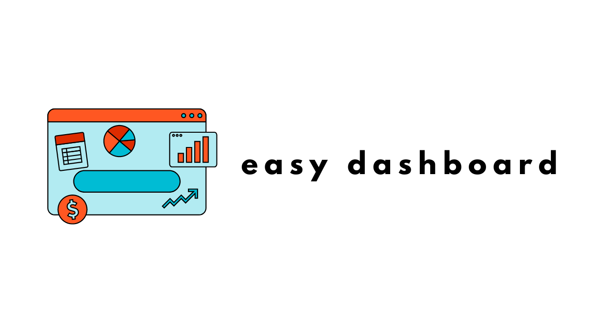

# easy-free-dashboard-app
A web application designed for the creation of interactive dashboards.

Aplikacja do tworzenia interaktywnych dashboardów umożliwiająca wizualizację i analizę danych z plików CSV i Excel.

## Wprowadzenie

Projekt ma na celu umożliwienie użytkownikom szybkiego tworzenia prostych, ale funkcjonalnych dashboardów do analizy danych. 
Aplikacja jest projektowana z myślą o osobach początkujących w analizie danych, oferując intuicyjny interfejs użytkownika oraz podstawowe funkcje wizualizacji danych.

## Funkcjonalności

- Import danych z plików CSV i Excel.
- Tworzenie podstawowych wykresów: liniowych, słupkowych, kołowych.
- Proste filtry do interaktywnej analizy danych.

## Benchmarking, pomysły, inspiracje

link do notatek w Notion 
https://ionized-show-a2f.notion.site/Benchmarking-pomys-y-inspiracje-e8b08fc6e0e940ad940d3952bee9ecd8?pvs=4 

## Dziennik prac nad projektem

link do dokumentu w Notion 
https://ionized-show-a2f.notion.site/Dziennik-prac-nad-aplikacj-Easy-Dashboard-e129cf22864649af9a471c4670bbac42?pvs=4 

### Podstawowy zakres MVP aplikacji Easy Free Dashboard App

**1. Podstawowa Integracja Źródeł Danych**

- **Obsługa Prostych Plików Danych**: Aplikacja powinna umożliwiać importowanie danych z plików CSV i Excel, co pozwoli użytkownikom na łatwe wgranie i analizowanie ich danych.

**2. Prosta Wizualizacja Danych**

- **Ograniczony Zestaw Typów Wykresów**: Aplikacja powinna oferować kilka podstawowych typów wykresów, takich jak wykresy liniowe, słupkowe i kołowe, które mogą być używane do większości podstawowych analiz danych.
- **Interaktywne Elementy**: Aplikacja powinna umożliwiać użytkownikom interakcję z danymi poprzez proste filtry, np. wybór zakresu dat lub kategorii do wyświetlenia.

**3. Intuicyjny Interfejs Użytkownika i Nawigacja**

- **Prosty i Intuicyjny UI**: Aplikacja powinna posiadać prosty i intuicyjny interfejs użytkownika, który umożliwi łatwe tworzenie i przeglądanie dashboardów.
- **Prosta Nawigacja**: Aplikacja powinna zawierać podstawową nawigację, umożliwiającą użytkownikom przełączanie się między różnymi dashboardami oraz łatwy dostęp do opcji importowania danych.

**4. Dokumentacja i Przewodniki**

- **Podstawowa Dokumentacja**: Aplikacja powinna zawierać prostą dokumentację i przewodniki użytkownika, które pomogą nowym użytkownikom zrozumieć, jak korzystać z aplikacji.
Dodatkowa opcja nagranie materiału wideo z tłumaczeniem krok po kroku funkcjonalności aplikacji od uruchomienia po użytkowanie w postaci krótkiego kursu wideo.

** Dodatkowe Funkcje (Opcjonalnie)**

- Pojawi się wkrótce - rozważam pomysły, zależy mi na atrakcyjności aplikacji i jej użyteczności przy jednoczesnym realnym zrealizowaniu założeń w określonym czasie realizacji projektu oraz moich umiejętności, które będę budować wraz z rozwijaniem projektu.

### **Implementacja MVP**

- **Faza 1**: Skonfigurowanie środowiska projektowego i nauka potrzebnych technologii.
- **Faza 2**: Implementacja funkcjonalności importowania danych i podstawowej wizualizacji danych.
- **Faza 3**: Opracowanie interfejsu użytkownika i nawigacji.
- **Faza 4**: Przygotowanie podstawowej dokumentacji i przewodników użytkownika.

## Technologie, narzędzia
Lista może ulegać zmianie, aplikacja jest na etapie pracy koncepcyjnej. 

- Python
- Dash / Streamlit / Vizro
- Pandas
- Plotly
- Figma (projektowanie UI/UX)
- HTML, CSS (?)
- SQLite
- SQLAlchemy

## Linki do materiałów pomocniczych i dokumentacji
Dokumentacja  
https://docs.dash.org/projects/platform/en/stable/docs/intro/what-is-dash.html 
https://vizro.readthedocs.io/en/stable/ 

kanały na YouTube 
https://www.youtube.com/@CharmingData 
https://www.youtube.com/@DataProfessor 
https://www.youtube.com/@AlexTheAnalyst 
https://www.youtube.com/@Thuvu5 
https://www.youtube.com/@SophiaYangDS 

tutoriale:  
https://youtu.be/wQmyT5fzruE?feature=shared 
https://www.youtube.com/watch?v=wmQ6_GZ0zSk 

książki pomocnicze 
"Jak analizować dane z biblioteką Pandas. Praktyczne wprowadzenie." Daniel Y.Chen wyd. Helion  
"SQL dla Analityków Danych." J.Shan, M.Goldwasser, U.Malik, B.Johnston wyd. Helion  

## Nauka / praktyka
11.03.2024 - Vizro, praca z tutorialem https://www.youtube.com/watch?v=wmQ6_GZ0zSk  
12.03.2024 - Vizro, praca z tutorialem https://www.youtube.com/watch?v=wmQ6_GZ0zSk  
13.03.2024 - czytanie dokumentacji Dash
14.03.2024 - książka, dokumentacja Vizro
15.03.2024 - książka "Jak analizować dane z biblioteką Pandas. Praktyczne wprowadzenie. Wyd II" wyd. Helion Daniel Y.Chen

## Jak Uruchomić

Instrukcje krok po kroku dotyczące konfiguracji środowiska, instalacji zależności i uruchamiania aplikacji. 
Instrukcje będą dostępne wkrótce.

## Dokumentacja aplikacji

Szczegółowe przewodniki i dokumentacja pomagające użytkownikom w korzystaniu z aplikacji.

Linki do dokumentacji i inspiracji.

Dokumentacja dostępna wkrótce. 

## Licencja

Dostępna wkrótce.

## Harmonogram Projektu

Wstępny harmonogram rozpisany na 100 dni realizacji projektu.
W pierwszych 30 dniach realizacji projektu zakres będzie ulegać zmianie wraz z dynamicznym rozwojem prac nad projektem.

1. **Dni 1-10: Faza Planowania**
    - Zdefiniowanie dokładnych wymagań MVP.
    - Wybór stosu technologicznego i narzędzi.
    - Uczenie się potrzebnych technologii.
2. **Dni 11-30: Rozwój Podstawowych Funkcjonalności**
    - Implementacja obsługi plików CSV i Excel (import danych).
    - Rozwój podstawowych typów wykresów (liniowych, słupkowych, kołowych).
3. **Dni 31-50: Rozwój Interfejsu Użytkownika i Nawigacji**
    - Projektowanie i implementacja interfejsu użytkownika.
    - Dodanie prostych filtrów do interakcji z danymi na wykresach.
4. **Dni 51-70: Testowanie i Dokumentacja**
    - Testowanie funkcjonalności i interfejsu użytkownika.
    - Pisanie podstawowej dokumentacji i przewodników użytkownika.
5. **Dni 71-85: Implementacja Funkcji Dodatkowych (Opcjonalnie)**
    - Dodanie mechanizmu tłumaczenia terminologii (jeśli czas pozwoli).
6. **Dni 86-100: Przygotowanie do Wdrożenia i Finalizacja**
    - Optymalizacja i debugowanie aplikacji.
    - Przygotowanie aplikacji do wdrożenia.
    - Finalizacja dokumentacji i przygotowanie repozytorium GitHub.

## TO DO lista zadań w projekcie
(harmonogram zostanie ostatecznie podzielony na 14 bloków po 7 dni)

| Tydzień | Zadania |
| --- | --- |
| 1-2 | Definicja zakresu projektu Wybór technologii Przygotowanie środowiska pracy Praca koncepcyjna |
| 3 | Doszlifowanie wiedzy z Python |
| 4 | Przepracowanie tutoriali Flask i Dash Stworzenie prostej aplikacji webowej |
| 5 | Nauka podstaw SQLite i SQLAlchemy Projektowanie schematu bazy danych |
| 6-7 | Nauka Pandas i Plotly Tworzenie wizualizacji danych |
| 8 | Projektowanie UI/UX w Figma dla aplikacji |
| 9 | Rozwój backendu aplikacji Integracja z bazą danych |
| 10 | Połączenie UI z logiką aplikacji Pierwsze testy integracyjne |
| 11 | Implementacja testów jednostkowych Refaktoryzacja kodu |
| 12 | Optymalizacja wydajności aplikacji Testy użyteczności |
| 13 | Tworzenie dokumentacji dla użytkowników i developerów |
| 14 | Wdrożenie aplikacji Zbieranie i implementacja feedbacku |

## **Kontakt**

Jeśli masz pomysł na rozwój projektu lub uwagi daj koniecznie znać!
mail: aleksandra.zbieranska@gmail.com
